<!-- markdownlint-disable MD033 MD041 -->

<div align="center">

# NovaTune

### A premium Windows music player with Spotify-dark aesthetics.

*Built for music lovers who were abandoned by every player Microsoft shipped.*

[](./package.json)
[]()
[](./LICENSE)
[]()
[]()

<!-- Replace with your own logo / hero banner — recommended 1200×400 -->

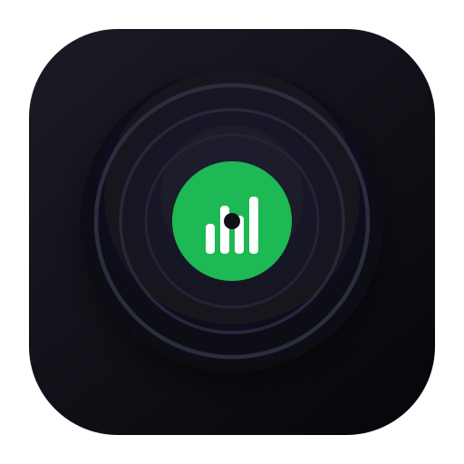

### Download

[](https://github.com/novatune/player/releases/latest)

> **Prefer a portable build?** Grab `NovaTune-Portable-1.0.0.exe` from the [Releases page](https://github.com/novatune/player/releases) — no installer, just double-click and play.

</div>

---

## Why I Built NovaTune — An Honest Story

I never set out to write a music player. I just wanted to listen to music on my laptop the way I do on my phone.

On Android, an app called **[Oto Music](https://play.google.com/store/apps/details?id=com.piyush.music)** quietly became the gold standard. Built largely by **one person** — Piyush Mamidwar — it crossed **2 million downloads** and held a steady **4.6-star rating** for years. It was *Material You to the core*: accent colors that flowed from your wallpaper, a beautiful full-screen lyrics view, gapless playback, a built-in tag editor, a folder blacklist so your ringtones never polluted your library, and synced lyrics pulled from **four different sources**. It was free. It was ad-free. It was feature-complete. It proved that a local music player could be beautiful and powerful at the same time. ([Android Police called it "the only one I kept."](https://www.androidpolice.com/i-tested-dozens-of-music-players-and-this-is-the-only-one-i-kept))

Then I looked at my Windows laptop. And Windows has a music player problem it has never solved.

- **Groove Music** was killed in 2017. Microsoft pulled its streaming service on October 2, 2017, pushed everyone to Spotify, and along the way [dropped the visualizations](https://forums.tomshardware.com/threads/what-happened-to-visualizations-in-groove-music.3802422) instead of re-licensing them. Gapless playback took *"years of crying and begging."* Even now, years after it was replaced, [users on Microsoft Q&A are still asking](https://learn.microsoft.com/en-us/answers/questions/4168983/any-way-to-get-back-old-groove-music-player) *"Is there any way to get back the old Groove Music player? The interface was way much better."*
- **The new Windows 11 Media Player** looks pretty, and then it betrays you. Users on r/Windows11 [report it locking up mid-song](https://www.reddit.com/r/Windows11/comments/1fnut0w/the_modern_media_player_in_windows_11_is_not_up), repeating the last 5 seconds of audio in a loop until you kill it from Task Manager. It's [slower to open than VLC and even the legacy WMP](https://windowsforum.com/threads/windows-11-media-player-11-2605-14-0-new-fixes-but-still-slower-than-legacy.426588). It routinely [can't detect music that's clearly on disk](https://www.reddit.com/r/windows/comments/sy779s/new_windows_11_media_player_wont_display_any_of). It [throws `0x80070005` when you try to create a playlist](https://www.elevenforum.com/t/cant-create-playlist-in-windows-11-media-player-app.30794) — and the community answer is literally *"switch to Foobar2000, it's free."* Worse, [songs silently disappear from your playlists](https://www.bleepingcomputer.com/forums/t/709061/songs-missing-on-windows-media-player-playlists) — sometimes 50% of them — and the player tells you it *"cannot find the file"* for files that are still sitting right there on your hard drive. And synced lyrics? Forget it. The old WMP 11 karaoke-style lyrics pane was stripped. Anyone asking [how to display lyrics](https://community.mp3tag.de/t/display-lyrics-in-windows-media-player/54347) in the modern player is told to go install Dopamine or foobar2000.
- **Windows Media Player Legacy** is still there — as an *Optional Feature* you have to install manually. Microsoft's own Insider forum admits it ["still looks like it's from the 2000s"](https://techcommunity.microsoft.com/discussions/windowsinsiderprogram/windows-11-media-player-legacy-still-looks-like-it%E2%80%99s-from-the-2000s/4512415), its DRM services are [officially deprecated](https://learn.microsoft.com/en-us/windows/whats-new/deprecated-features), and on some installs it [refuses to open at all](https://www.reddit.com/r/WindowsHelp/comments/1p7isbs/is_this_common_with_windows_11_windows_media).

In short: Windows users are stuck choosing between a buggy modern app that lost the plot, a dead 2017 streaming husk, and a player frozen in 2000s amber. Meanwhile Android users have had Oto Music for years.

So I built NovaTune.

NovaTune is what happens when you take the Oto Music philosophy — beautiful, ad-free, feature-complete, local-first — and bring it to Windows. Synced lyrics from the open **[LRCLIB](https://lrclib.net)** database (better sync quality than Musixmatch, [according to MusicBee users](https://getmusicbee.com/forum/index.php?topic=36952.540), with zero API keys and zero profit motive). A real 10-band parametric equalizer with 20 presets. Crossfade and gapless playback through a professional Web Audio API pipeline. A library scanner that doesn't choke. Themes that can pull their accent color straight from the album art of whatever's playing. A squiggly progress bar that animates on its own off-main-thread canvas. Playlists that actually keep their songs. A lyrics editor. A tag-aware metadata engine that reads anything `music-metadata` can parse — MP3, FLAC, WAV, OGG, M4A, AAC, WMA, and more.

This is the music player Windows should have shipped. Since it didn't, I did.

---

## What is NovaTune

NovaTune is a **native Windows desktop music player** built with **Electron 28**, **Node.js native modules** (`better-sqlite3`, `sharp`, `node-vibrant`, `music-metadata`, `electron-updater`), and a custom **Web Audio API** mastering pipeline. It is single-instance, frameless, dark by default, and integrates with the Windows System Media Transport Controls (SMTC) so your media keys, lock screen, and taskbar flyout all work the way they should.

It is **not** a streaming client. It is **not** a cloud anything. Point it at a folder of your own music files, and it builds a fast, searchable, beautiful local library. Your data stays on your machine.

|                     |                                                     |
| ------------------- | --------------------------------------------------- |
| **App ID**          | `com.novatune.player`                               |
| **Version**         | 1.0.0                                               |
| **License**         | MIT                                                 |
| **Platform**        | Windows x64 (NSIS installer + portable build)       |
| **Aesthetic**       | Spotify-dark, Material-You-aware accent system      |
| **Library backend** | SQLite (WAL mode) with JSON-denormalized track rows |
| **Audio backend**   | Web Audio API + (optional) WASAPI exclusive mode    |

---

## Table of Contents

- [Why I Built NovaTune — An Honest Story](#why-i-built-novatune--an-honest-story)
- [What is NovaTune](#what-is-novatune)
- [Screenshots](#screenshots)
- [Feature Highlights](#feature-highlights)
- [The Squiggly Progress Bar](#the-squiggly-progress-bar)
- [Audio Engine](#audio-engine)
- [Lyrics System](#lyrics-system)
- [Library & Metadata](#library--metadata)
- [Playlists](#playlists)
- [Theming & Accent Colors](#theming--accent-colors)
- [Windows Integration](#windows-integration)
- [Settings Reference](#settings-reference)
- [Keyboard Shortcuts](#keyboard-shortcuts)
- [Project Map](#project-map)
- [Tech Stack](#tech-stack)
- [Build From Source](#build-from-source)
- [A Note About Screen Sizes (14″ vs 13″)](#a-note-about-screen-sizes-14-vs-13)
- [Known Limitations & Quirks](#known-limitations--quirks)
- [Roadmap](#roadmap)
- [Contact the Developer](#contact-the-developer)
- [Credits](#credits)
- [License](#license)

---

## Screenshots

> Add each screenshot to a `screenshots/` folder at the root of your repo, then keep these paths. Recommended sizes are noted under each placeholder.

### App Sections

<table>
  <tr>
    <td width="50%" align="center">
      <b>Home</b><br/>
      <sub>Hero banner with library stats, Shuffle Library button, Recently Added and Recently Played grids. Recommended 1280×800.</sub><br/><br/>
      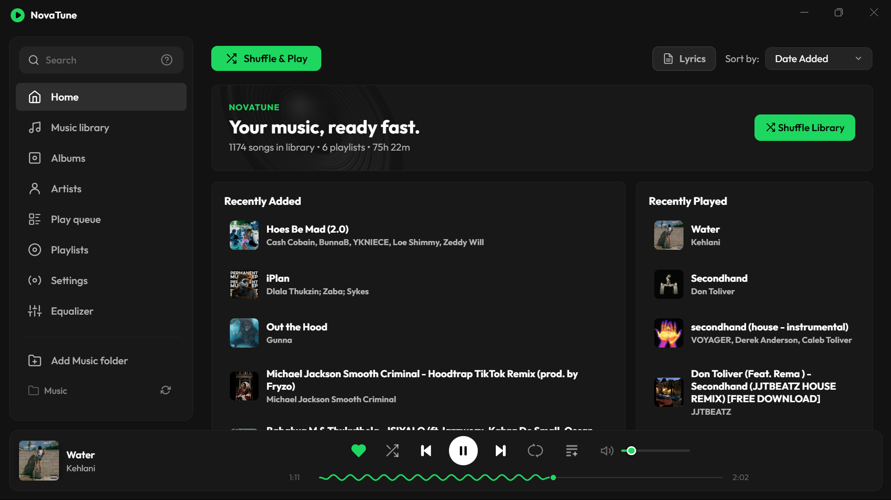
    </td>
    <td width="50%" align="center">
      <b>Music Library</b><br/>
      <sub>Virtual-scrolling track list with column headers, sort dropdown, and lyrics toggle. Recommended 1280×800.</sub><br/><br/>
      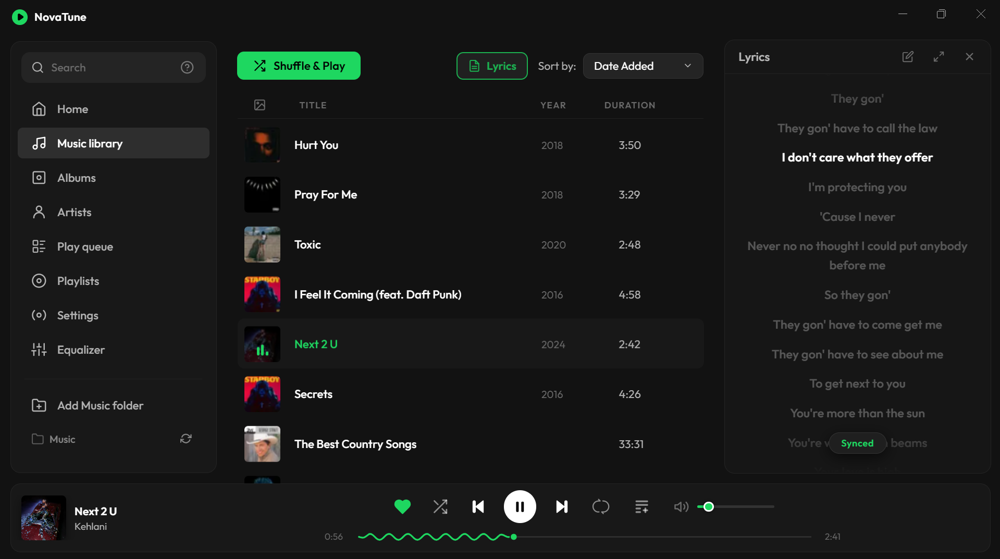
    </td>
  </tr>
  <tr>
    <td width="50%" align="center">
      <b>Albums</b><br/>
      <sub>Grid of album cards with auto-extracted cover art; click any card to open the album detail view. Recommended 1280×800.</sub><br/><br/>
      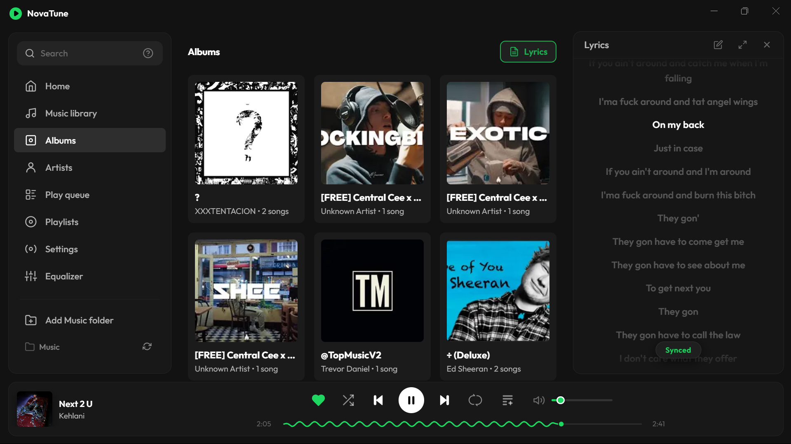
    </td>
    <td width="50%" align="center">
      <b>Album Detail</b><br/>
      <sub>Full track listing for an album with Play / Shuffle / Share actions. Recommended 1280×800.</sub><br/><br/>
      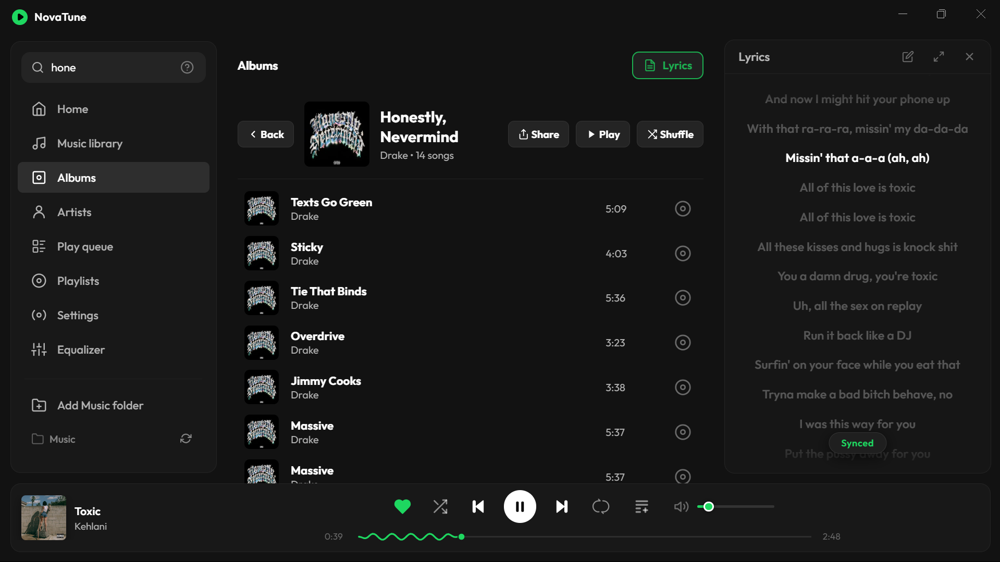
    </td>
  </tr>
  <tr>
    <td width="50%" align="center">
      <b>Artists</b><br/>
      <sub>Grid of artist cards built from ID3 / Vorbis / iTunes tags. Recommended 1280×800.</sub><br/><br/>
      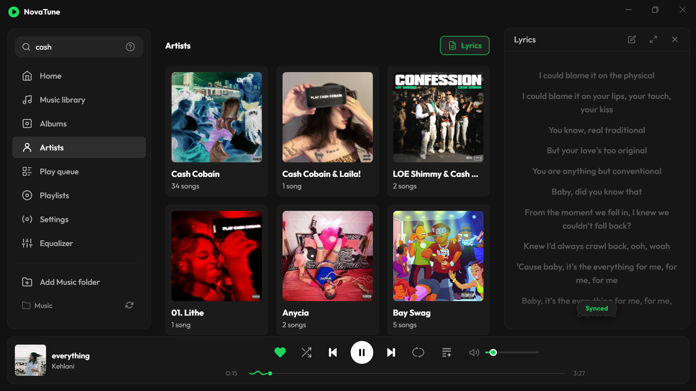
    </td>
    <td width="50%" align="center">
      <b>Artist Detail</b><br/>
      <sub>Every track featuring that artist, queued in one click. Recommended 1280×800.</sub><br/><br/>
      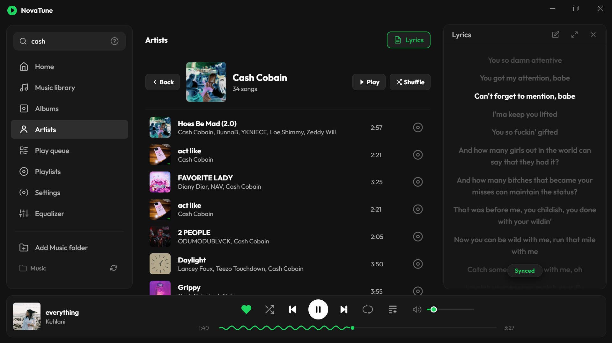
    </td>
  </tr>
  <tr>
    <td width="50%" align="center">
      <b>Play Queue</b><br/>
      <sub>Current queue with drag-to-reorder and right-click to remove. Recommended 1280×800.</sub><br/><br/>
      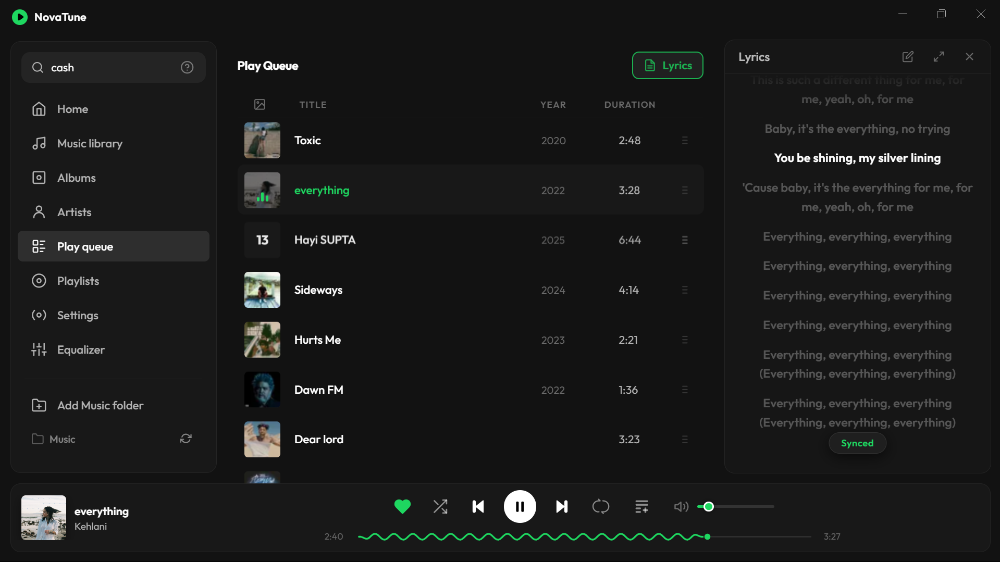
    </td>
    <td width="50%" align="center">
      <b>Playlists</b><br/>
      <sub>Grid of playlist cards with auto-generated 4-track cover collages. Recommended 1280×800.</sub><br/><br/>
      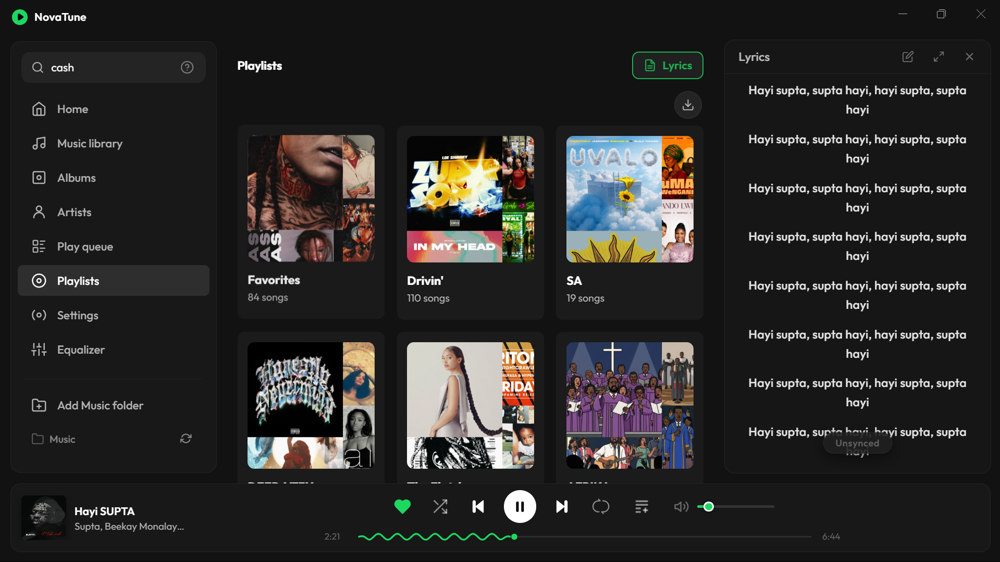
    </td>
  </tr>
  <tr>
    <td width="50%" align="center">
      <b>Playlist Detail</b><br/>
      <sub>Single playlist with its tracks, Play / Shuffle / Export actions. Recommended 1280×800.</sub><br/><br/>
      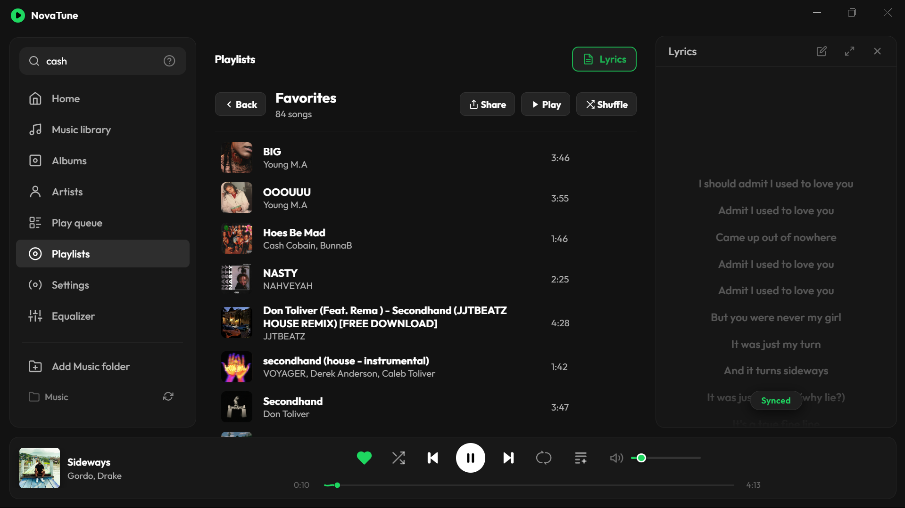
    </td>
    <td width="50%" align="center">
      <b>Lyrics Panel</b><br/>
      <sub>Synced lyrics auto-scrolling with the current line highlighted; click any line to seek. Recommended 1280×800.</sub><br/><br/>
      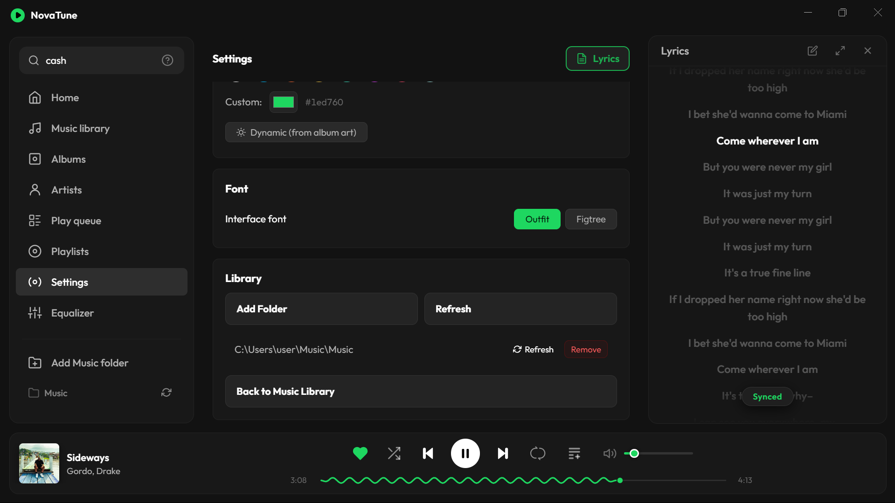
    </td>
  </tr>
  <tr>
    <td width="50%" align="center">
      <b>Lyrics Editor</b><br/>
      <sub>Three-tab modal: search LRCLIB, paste/type, or load a <code>.lrc</code> file. Recommended 1280×800.</sub><br/><br/>
      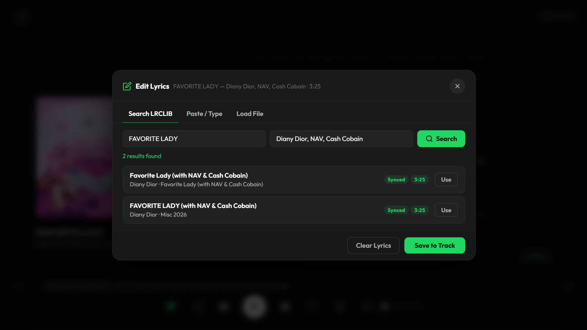
    </td>
    <td width="50%" align="center">
      <b>Now Playing Overlay</b><br/>
      <sub>Full-screen Now Playing view with blurred album-art background and particle constellation animation. Recommended 1280×800.</sub><br/><br/>
      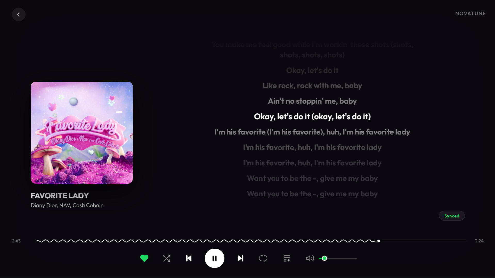
    </td>
  </tr>
  <tr>
    <td width="50%" align="center">
      <b>Equalizer</b><br/>
      <sub>10-band parametric EQ with 20 presets, master toggle, and volume boost up to 2×. Recommended 1280×800.</sub><br/><br/>
      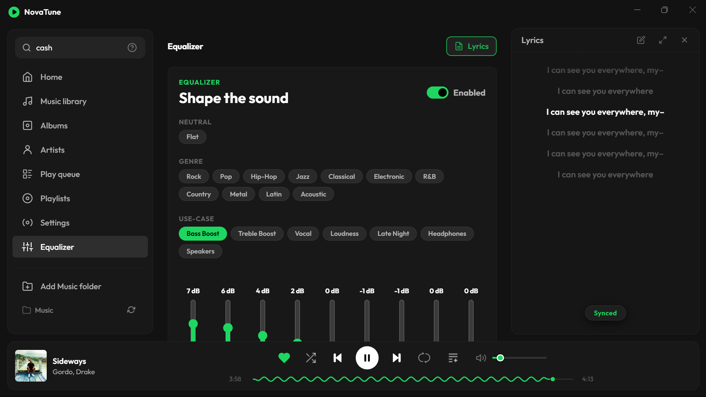
    </td>
    <td width="50%" align="center">
      <b>Visualizer</b><br/>
      <sub>Three styles — bars, wave, circle — with custom colors and sensitivity. Recommended 1280×800.</sub><br/><br/>
      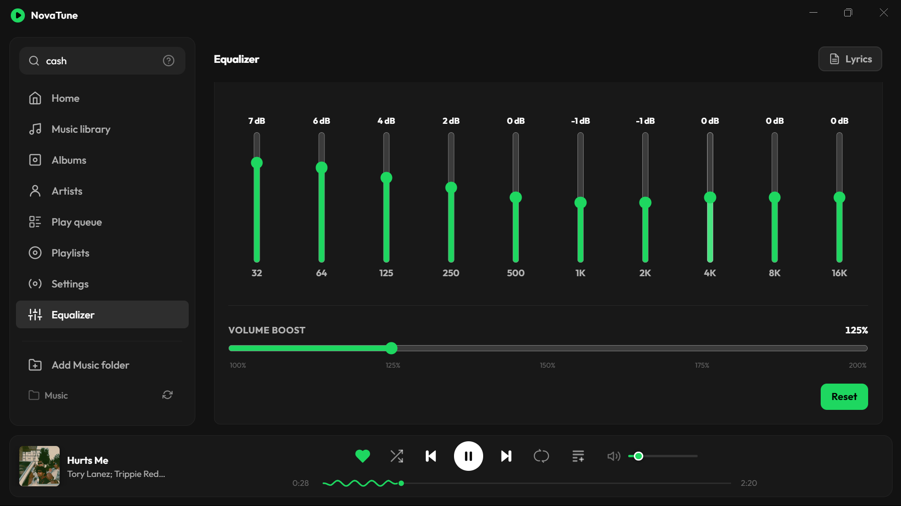
    </td>
  </tr>
  <tr>
    <td width="50%" align="center">
      <b>Settings</b><br/>
      <sub>Four-card layout: Playback, Accent Colour, Font, Library. Recommended 1280×800.</sub><br/><br/>
      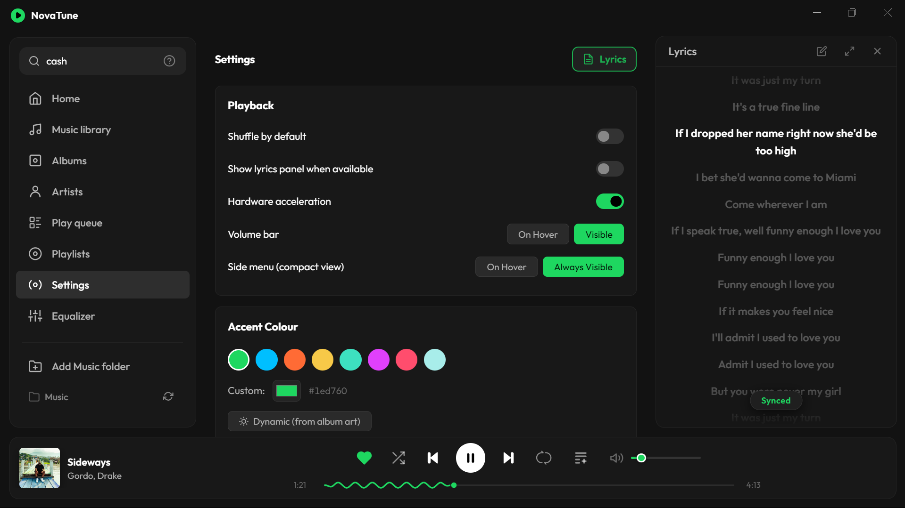
    </td>
    <td width="50%" align="center">
      <b>Help Center</b><br/>
      <sub>Built-in help with every feature explained and a direct WhatsApp support button. Recommended 1280×800.</sub><br/><br/>
      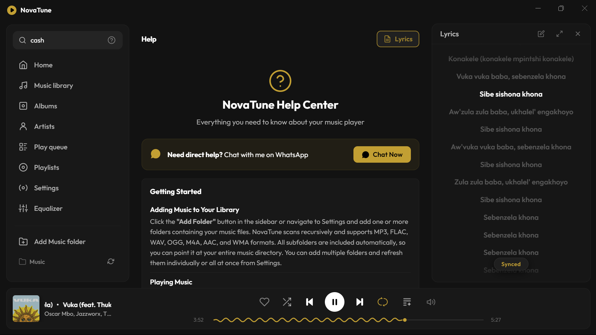
    </td>
  </tr>
  <tr>
    <td width="50%" align="center">
      <b>Scan Progress</b><br/>
      <sub>Overlay shown while NovaTune scans a folder — stages from scanning to reading metadata to saving. Recommended 600×400.</sub><br/><br/>
      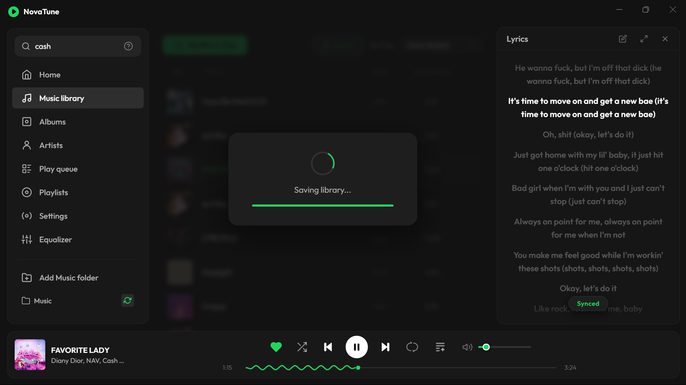
    </td>
    <td width="50%" align="center">
      <b>Tray / SMTC Integration</b><br/>
      <sub>Windows lock-screen media controls showing album art, title, artist, and seek bar — driven by SMTC. Recommended 600×400.</sub><br/><br/>
      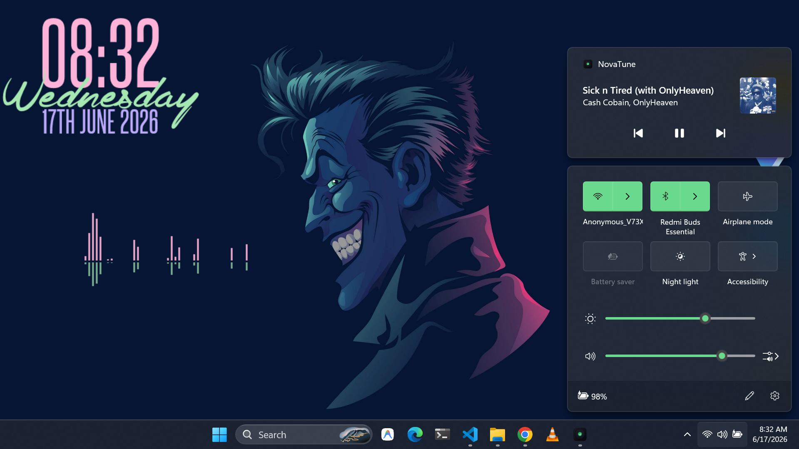
    </td>
  </tr>
</table>

### Theme Color Showcase

> Replace these three placeholders with screenshots of NovaTune running with different accent colors (Spotify Green, Sky Blue, Orange, Pink, etc.) — or with Dynamic Accent enabled, so the color follows the album art.

<table>
  <tr>
    <td width="33%" align="center">
      <b>Theme: Spotify Green (default)</b><br/>
      <sub>Same view, default accent.</sub><br/><br/>
      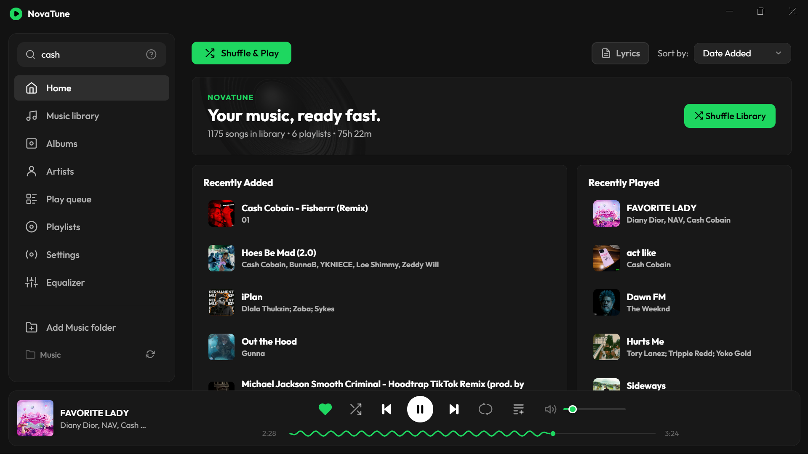
    </td>
    <td width="33%" align="center">
      <b>Theme: Sky Blue</b><br/>
      <sub>Same view, blue accent.</sub><br/><br/>
      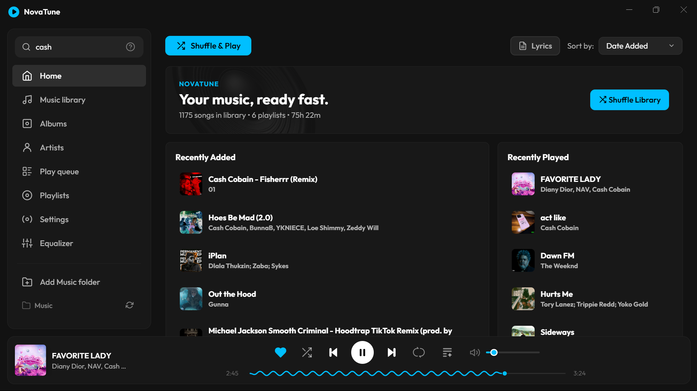
    </td>
    <td width="33%" align="center">
      <b>Theme: Dynamic Accent (from album art)</b><br/>
      <sub>Same view, accent extracted from the playing track's cover via node-vibrant.</sub><br/><br/>
      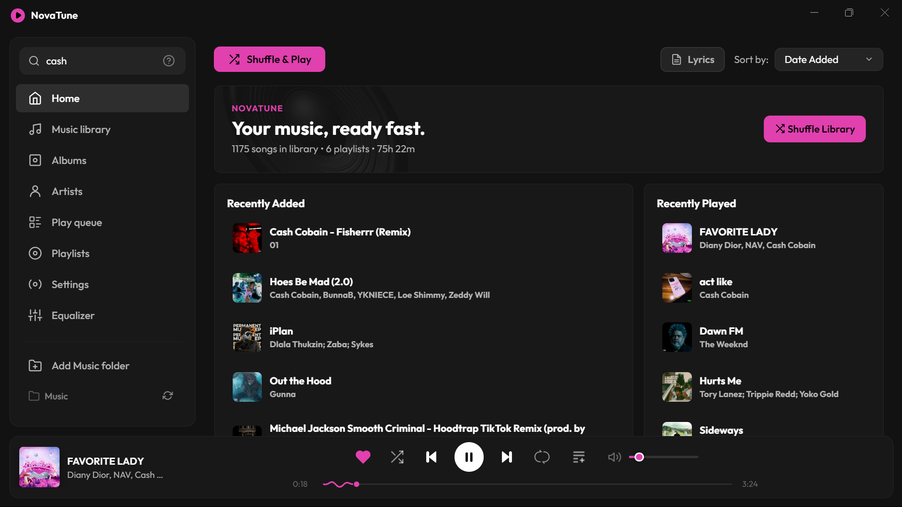
    </td>
  </tr>
</table>

### Responsiveness

> Replace these three placeholders with screenshots at different window widths (full desktop width, narrow window, and overlay/mobile-style layout) to show how the sidebar collapses and the layout adapts.

<table>
  <tr>
    <td width="33%" align="center">
      <b>Wide layout (≥ 1280 px)</b><br/>
      <sub>Full sidebar visible, three-column grid for albums.</sub><br/><br/>
      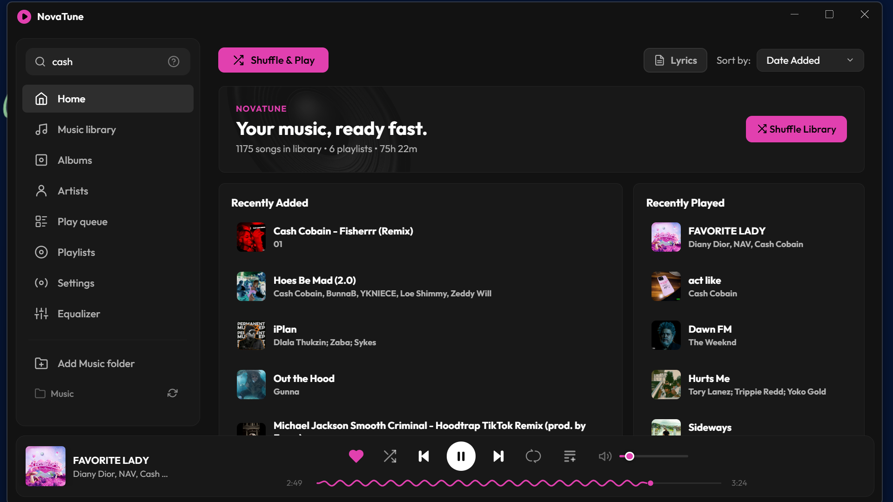
    </td>
    <td width="33%" align="center">
      <b>Medium layout (~ 950 px)</b><br/>
      <sub>Sidebar collapses to hover-revealed icon strip; grid tightens.</sub><br/><br/>
      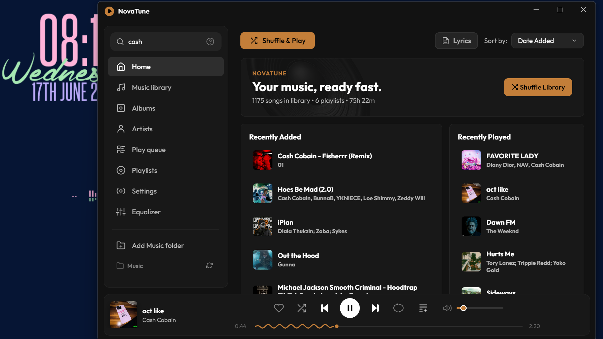
    </td>
    <td width="33%" align="center">
      <b>Narrow / compact layout</b><br/>
      <sub>Floating art card, icon-only navigation, single-column grid.</sub><br/><br/>
      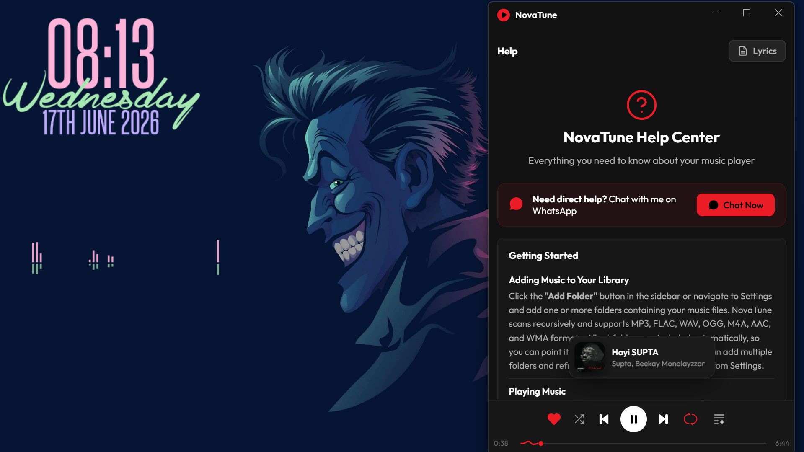
    </td>
  </tr>
</table>

---

## Feature Highlights

- **Premium Spotify-dark aesthetic** — 12 / 18 / 24 hex surface stack, custom titlebar overlay, frameless window.
- **Synced lyrics from 5 sources** — in-memory cache → SQLite → `.lrc` sidecar → embedded tags (USLT/SYLT/Vorbis/iTunes/APEv2) → [LRCLIB](https://lrclib.net) online. Auto-scroll with click-to-seek.
- **Real 10-band parametric EQ** — 32 Hz to 16 kHz, 20 presets, master toggle, volume boost up to 2×.
- **Equal-power crossfade + gapless playback** — 1–12 s fade curves through a full mastering chain (compressor → analyser → boost → destination).
- **Three visualizer styles** — bars, wave, circle — running on a DPR-aware canvas with smoothed data and reflections.
- **The squiggly progress bar** — a signature AOSP-ported canvas animation that runs in an `OffscreenCanvas` driven by a Web Worker, so it never touches your main thread. Falls back gracefully to a SVG sine-wave overlay.
- **Dynamic accent from album art** — toggle it on and the entire UI (including the squiggly bar) recolors itself based on the dominant palette of whatever's playing, extracted by `node-vibrant`.
- **Album / artist / folder organization** — automatic grouping, album detail view, artist detail view.
- **Playlists done right** — full CRUD, drag-and-drop reordering, Favorites, and **import / export in M3U, M3U8, PLS, XSPF, and JSON**.
- **Exhaustive cover-art discovery** — embedded tags → `.novaart.*` sidecar → exact-name match → common names (`cover`, `folder`, `album`, `front`, `artwork`, `art`, …) → WMP cache files (`AlbumArt_{GUID}_Large.jpg`) → any image ≥5 KB in the same directory → subdirectories (1 level) → parent directories (up to 3 levels).
- **On-demand thumbnail generation** via `sharp` — WebP, center-cropped, with in-flight deduplication so 100 simultaneous requests for the same thumbnail produce one Sharp job.
- **SQLite library backend** with WAL journaling, indexed title / artist / album / dateAdded columns, and JSON-denormalized `data` column for schema flexibility.
- **Windows SMTC integration** — your media keys, lock-screen controls, and taskbar media flyout all work. Falls back to simulation mode if the native module isn't installed.
- **OTA updates via `electron-updater`** — auto-checks 60 s after launch, then every 4 hours, with manual "Check for Updates" in Help. User consent required for downloads.
- **Single-instance** — second launch focuses the existing window.
- **Window state persistence** — your window position, size, and maximized state survive restarts, with multi-display bounds validation.
- **Custom `nova-media://` protocol** — byte-range-accurate local file serving with correct MIME types, plus an LRU response cache (max 500 entries).
- **Frameless window with native Windows caption buttons** — `titleBarOverlay` with transparent background, no Electron-caption-button hacks.

---

## The Squiggly Progress Bar

This deserves its own section because it's the soul of NovaTune's UI.

The squiggly progress bar is a direct port of the AOSP (Android Open Source Project) `SquigglyProgress` animation. The wave:

- **Animates only while playing** — it freezes when paused, like a held breath.
- **Runs on an `OffscreenCanvas` driven by a dedicated Web Worker** (created from a Blob URL) so animation never blocks the main thread.
- **Falls back gracefully** — if `OffscreenCanvas` is unavailable or CSP blocks the Worker, it drops to a main-thread `requestAnimationFrame` loop.
- **Has an SVG sine-wave overlay** as a secondary implementation inside the bottom now-playing bar (`PlayerControls._injectWaveSvg`), with cosine/sine path tiles.
- **Color follows the active accent** — when Dynamic Accent is on, the worker receives a `postMessage` with the new color and the wave recolors instantly, in lockstep with the rest of the UI.
- **Click anywhere on the canvas to seek** — with a mouse-move preview showing where you'll land.

It is, frankly, the kind of detail Microsoft removed when they replaced Groove.

---

## Audio Engine

NovaTune runs audio through a fully wired Web Audio API graph — not just `<audio>` alone. The signal chain:

```
HTMLAudioElement
  → MediaElementAudioSourceNode
  → [EQEngine: preampGain → 10× BiquadFilter chain]      (only when EQ enabled)
  → GainNode (user volume, 0–1, 8 ms ramp)
  → DynamicsCompressorNode (transparent mastering limiter)
  → AnalyserNode (fftSize=8192, smoothing 0.8)
  → GainNode (volume boost, 1.0×–2.0×)
  → AudioContext.destination
```

### What this buys you

- **10-band parametric EQ** — bands at 32, 64, 125, 250, 500, 1k, 2k, 4k, 8k, 16 kHz; gain range −12 to +12 dB; lowshelf at 32 Hz, peaking through 64 Hz–8 kHz, highshelf at 16 kHz. Per-band Q tuned for natural sound (0.707 for shelves, 1.0–2.0 for peaking). 5 ms time constant for click-free adjustments.
- **20 EQ presets** grouped as **Neutral** (Flat), **Genre** (Rock, Pop, Hip-Hop, Jazz, Classical, Electronic, R&B, Country, Metal, Latin, Acoustic), and **Use-case** (Bass Boost, Treble Boost, Vocal, Loudness, Late Night, Headphones, Speakers).
- **Dynamic headroom protection** — preamp gain is automatically reduced as you boost bands, with `min(-4 dB, -maxBoost × 0.7)` clipping protection.
- **Transparent mastering limiter** — a `DynamicsCompressorNode` with -14 dB threshold, 8 dB knee, 4:1 ratio, 3 ms attack, 150 ms release. It catches transients without audibly squashing your music.
- **Equal-power crossfade** — `sin(phase) × targetVol` for fade-in, `cos(phase) × targetVol` for fade-out (preserves perceived loudness). 1–12 second duration, default 3 s.
- **Gapless playback** — `ended` event advances to the next track with zero silence in between, ideal for classical, live albums, and Pink Floyd.
- **Volume boost up to 2×** — post-analyser `GainNode` for quiet masters, with 8 ms ramp to avoid clicks. The visualizer sees the pre-boost signal so it stays musically meaningful.
- **WASAPI exclusive mode** on Windows — `--enable-exclusive-audio` Chromium flag for bit-perfect output on supported devices.
- **Device-native sample rate** — no forced resampling, no extra SRC artifacts.
- **Pre-allocated analyser buffers** — `Uint8Array` for `getByteFrequencyData` / `getByteTimeDomainData` are allocated once, eliminating 120 allocations/sec at 60 fps.

### Audio engine files

| File                            | Purpose                                                             |
| ------------------------------- | ------------------------------------------------------------------- |
| `renderer/audio/AudioEngine.js` | Web Audio graph, play/pause/seek/volume/boost, analyser data        |
| `renderer/audio/EQEngine.js`    | 10-band BiquadFilter chain + presets + headroom preamp              |
| `renderer/audio/Crossfader.js`  | Equal-power crossfade + gapless mode, full-graph secondary pipeline |
| `renderer/audio/Visualizer.js`  | Canvas 2D bars / wave / circle visualizer                           |

---

## Lyrics System

Lyrics in NovaTune are a 5-tier cascade. Whichever tier returns first wins, and the panel upgrades in place when a better source arrives — no "no lyrics" flash before the network response.

### Source priority (fast → slow)

1. **In-memory cache** (`Map<trackId, lyrics>`) — instant.
2. **SQLite-stored lyrics** — checks the `lyricsPath` on disk first, then the `syncedLyrics` / `plainLyrics` columns. ~1 ms.
3. **Local `.lrc` sidecar** — replaces the audio file's extension with `.lrc` (case-insensitive). ~2 ms.
4. **Embedded tag lyrics** — read by `music-metadata` from ID3v2.3 / ID3v2.4 USLT (unsynced) and SYLT (synced) frames, Vorbis Comments `LYRICS` (FLAC / OGG), iTunes `©lyr` (M4A / MP4), and APEv2 `LYRICS` (APE / Musepack). SYLT timestamps are converted from milliseconds to seconds when the `timeStampFormat` is `2`; frame-number format (`1`) is gracefully skipped.
5. **Online LRCLIB** — `https://lrclib.net/api/get` and `/api/search` are raced in parallel, with duration-aware matching (±2 s tolerance) and a 12 s timeout.

### LRC parser

The LRC parser supports `[mm:ss.xx]`, `[mm:ss:ms]`, `[mm:ss]`, multi-timestamp lines, and skips `[ti:]`, `[ar:]`, `[al:]`, `[by:]`, `[offset:]` metadata headers. If `plainLyrics` happens to contain LRC timestamps, they're auto-promoted into synced lyrics and stripped from the plain version — so the panel never shows raw `[00:15.04]` tokens to the user.

### Auto-scroll behavior

- **Synced lyrics** — smooth lerp scroll (13% per frame) centering the active line at 35–40% of the container height.
- **Manual scroll override** — any user scroll cancels in-flight programmatic lerp and pauses auto-scroll for 1500 ms. Auto-scroll resumes on the next line change.
- **Unsynced lyrics** — full manual control at all times. The app never fights your scroll position.
- **Click any synced line to seek** to that timestamp.
- A "synced" badge is shown when lyrics are time-stamped.

### Lyrics editor

A three-tab modal:

- **Search LRCLIB** — by title/artist; returns up to 20 results with synced/plain badges and a duration-match indicator. Retries 3× with 1.2 s backoff on failure.
- **Paste / Type** — a textarea accepting plain text or LRC format.
- **Load File** — drag-and-drop or browse for a `.lrc` or `.txt` file.

"Save to Track" writes a `.lrc` sidecar next to the audio file **and** patches the SQLite row. "Clear Lyrics" removes both the sidecar file and the DB entries.

### Lyric prefetch race

When a track is queued for playback, `prefetchLyrics()` fires the LRCLIB online fetch **in parallel** with audio init. By the time audio starts (~300–800 ms later), online lyrics are usually already cached — so the lyrics panel is populated from the moment the first note plays.

---

## Library & Metadata

### Folder scanning

- Recursive scan via `fs.readdirSync({ withFileTypes: true })`.
- Automatic skip list for system directories: `node_modules`, `.git`, `.svn`, `.hg`, `__pycache__`, `System Volume Information`, `$RECYCLE.BIN`, `Windows`, `Program Files`, `Program Files (x86)`, `ProgramData`, `AppData`.
- Hidden files (`.prefix`) are skipped.
- Per-file modification-time caching means unchanged files are skipped on rescan.
- Filename-pattern fallback — if a track has no tags, NovaTune parses `Artist - Title.ext`.
- Auto self-healing — if a file is missing, NovaTune looks for another DB track with the same title + artist and updates the path.
- Scan progress overlay shows stages: scanning → reading metadata → saving → complete / error.

### Supported formats

The scanner accepts **12 audio extensions**: `.mp3, .flac, .wav, .ogg, .m4a, .aac, .wma, .opus, .ape, .wv, .tta, .mpc`. Seven of them (`mp3, flac, wav, ogg, m4a, aac, wma`) are registered as Windows file associations so double-clicking a file in Explorer launches NovaTune.

### Metadata reading

Powered by `music-metadata` v8+ (ESM-only, loaded via dynamic `import()`). Reads title, artists (joined with `, `), album, albumArtist, genre, year, track number, disc number, duration, bitrate, sample rate, number of channels, and container format. If the library can't load, NovaTune falls back to filename-based metadata only.

### Cover art discovery (multi-tier)

NovaTune will try, in order:

1. Embedded picture tag (from `music-metadata`).
2. `.novaart.{jpg,jpeg,png,webp}` sidecar (downloaded online art saved next to the audio file).
3. Exact-name match (`Song.jpg` for `Song.mp3`).
4. Common names: `cover`, `folder`, `album`, `front`, `artwork`, `art`, `thumb`, `thumbnail`, `back`, `insert`, `booklet`, `jacket`, `label`, `sticker`.
5. WMP hidden cache files: `AlbumArt_{GUID}_Large.jpg`, `AlbumArtSmall.jpg`.
6. Any image ≥5 KB in the same directory.
7. Subdirectories (1 level) — same priority tiers.
8. Parent directories (up to 3 levels) — common names only.

### Thumbnail generation

Powered by `sharp`. Center-cropped square, resized to the target size (32–800 px, default 48 px), saved as WebP quality 75–80 (25–35% smaller than PNG, faster to decode) to `cached_covers/thumbs/{trackId}_{size}.webp`. Simultaneous requests for the same `trackId+size` share one Sharp job — in-flight deduplication prevents redundant CPU and disk I/O. An IndexedDB cache (`NovaTuneThumbCache`) persists thumbnail URLs across launches.

### SQLite schema

Database file: `novatune.sqlite` in WAL journal mode.

- `tracks` — `id` (TEXT PK, first 16 chars of `sha256(filePath)`), denormalized columns for `title`, `artist`, `album`, `genre`, `year`, `duration`, `dateAdded`, `filePath` (TEXT UNIQUE), plus a `data` TEXT column holding the full track JSON for schema flexibility.
- Indexes on `title`, `artist`, `album` (case-insensitive), and `dateAdded DESC`.
- `playlists` — `id`, `name`, `createdAt`, `updatedAt`, indexed on `updatedAt DESC`.
- `playlist_tracks` — `playlistId`, `trackId`, `position`, `addedAt`, with composite indexes.
- A legacy `library.json` and `playlists/*.json` are auto-migrated to SQLite on first run.

---

## Playlists

### CRUD

- **Create** — right-click the "Playlists" section header in the sidebar, or click the create button.
- **Rename** — double-click any playlist in the sidebar for an inline rename dialog, or right-click for the context menu.
- **Delete** — right-click → Delete. Cascades to `playlist_tracks`.
- **Add track** — drag-and-drop a song onto a playlist in the sidebar, or right-click a song and use "Add to Playlist" from the context menu. The context menu lists all playlists with "Added" / "Quickly Add" status; "+ New Playlist" creates and adds in one action.
- **Reorder** — drag-and-drop in the Play Queue view.
- **Remove from queue** — right-click in the queue.

### Favorites

Click the heart icon on any song to add it to your Favorites playlist. The Favorites playlist is auto-created on the first heart-click. The heart toggle appears in both the now-playing bar and the full-screen overlay. Click again to unfavorite.

### Cover collages

Every playlist gets an auto-generated 4-track cover collage built from the first four tracks' art, rendered as a WebP with content-hash invalidation so the collage regenerates only when the underlying tracks change.

### Import / Export

| Format   | Encoding | Notes                                                                                                                      |
| -------- | -------- | -------------------------------------------------------------------------------------------------------------------------- |
| **M3U**  | latin1   | `#EXTM3U` header + `#EXTINF:duration,Artist - Title` lines. Latin1 for legacy Windows player compatibility.                |
| **M3U8** | UTF-8    | Same as M3U but UTF-8 — use this for non-ASCII filenames.                                                                 |
| **PLS**  | UTF-8    | `[playlist]` header + `File{n}=`, `Title{n}=`, `Length{n}=`.                                                               |
| **XSPF** | UTF-8    | XML with`` blocks, `file:///` locations, escaped entities.                                                          |
| **JSON** | UTF-8    | `{name, createdAt, updatedAt, tracks: [{filePath, title, artist, album, duration}]}` — NovaTune's native portable format. |

Import uses cross-platform basename matching, so playlists exported from an Android player (e.g. `/storage/emulated/0/Music/song.mp3`) resolve correctly on Windows (`C:\Users\...\Music\song.mp3`). Import reports matched vs. unmatched counts with a details dialog.

---

## Theming & Accent Colors

### Color palette (default — Spotify dark)

| Token                      | Value                  |
| -------------------------- | ---------------------- |
| `--bg`                     | `#121212`              |
| `--sidebar-bg`             | `#181818`              |
| `--surface`                | `#242424`              |
| `--surface-hover`          | `#2a2a2a`              |
| `--surface-active`         | `#2e2e2a`              |
| `--green` (default accent) | `#1ed760`              |
| `--green-hover`            | `#1fdf64`              |
| `--text-primary`           | `#ffffff`              |
| `--text-secondary`         | `#b3b3b3`              |
| `--text-muted`             | `#6a6a6a`              |
| `--app-font`               | `"Outfit", sans-serif` |

### Accent colors

Eight preset swatches:

| Name          | Hex       |
| ------------- | --------- |
| Spotify Green | `#1ed760` |
| Sky Blue      | `#00bfff` |
| Orange        | `#ff6b35` |
| Yellow        | `#f7c948` |
| Mint          | `#3de0c0` |
| Pink          | `#e040fb` |
| Red           | `#ff4d6d` |
| Ice           | `#a8edea` |

Plus a custom color picker (any HTML color input) and **Dynamic Accent** — a toggle that uses `node-vibrant` to extract `Vibrant → LightVibrant → Muted → DarkVibrant` from the current track's cover art. The entire UI recolors instantly, including the squiggly progress bar (a `postMessage` to the OffscreenCanvas Worker).

For the full-screen Now Playing overlay, NovaTune extracts `DarkVibrant → DarkMuted → Vibrant → Muted` and darkens it if the luminance is above 0.4, so the background always reads as "moodily dark" rather than "loudly purple."

### Fonts

- **Outfit** (default) — preloaded 300 / 400 / 500 weights.
- **Figtree** (optional) — all 7 weights preinstalled; CSS loaded with `media="not all"` then activated via JS once loaded (non-blocking).

### Sidebar modes (compact view, narrow screens)

- **On Hover** — swipe from the left edge or hover near the left edge to reveal a floating icon nav strip. Auto-hides after 2500 ms on touch.
- **Always Visible** — the icon strip persists.
- Edge detection (mouse + touch) with 100 ms show delay, 300 ms hide delay, 2500 ms touch hide delay.
- The real sidebar shows on wide screens (>950 px); a floating card shows on narrow screens.

### Volume bar modes

- **On Hover** — slider appears when hovering the volume icon.
- **Visible** — slider always shown for quick adjustments.

---

## Windows Integration

### SMTC (System Media Transport Controls)

Implemented in `main/smtc.js` using the optional `windows-media-controls` native module. If the module isn't installed, NovaTune falls back to a simulation mode and continues to function. SMTC forwards OS media button events to the renderer (`smtc:play`, `smtc:pause`, `smtc:next`, `smtc:previous`, `smtc:stop`, `smtc:seek`), and the renderer pushes state back via IPC (`smtc:update-metadata`, `smtc:update-status`, `smtc:update-position`). Cover art for SMTC is saved as a temp file (`novatune-smtc-thumb.{jpg|png}`) on the fly. SMTC is only initialized on Windows (`process.platform === "win32"`).

This is what makes your **media keys**, **lock-screen controls**, and **taskbar media flyout** all work — they show the track title, artist, album art, and a seek bar.

### Frameless window with native caption buttons

`titleBarStyle: "hidden"` + Windows `titleBarOverlay` (transparent background, `#b3b3b3` symbols, 32 px height). The native Windows caption buttons (minimize / maximize / close) are drawn by Windows itself, not by Electron, so they look and behave exactly as expected. A custom in-app titlebar shows the NovaTune logo and name.

### Window state persistence

`WindowStateManager` saves `{ x, y, width, height, isMaximized }` to `window-state.json`. On restore, it validates that the position is within multi-display bounds and resets if the window would be off-screen. Default size: 1280×720. Minimum: 360×420.

### Native menus

`Menu.setApplicationMenu(null)` — no native menu bar. All menus are in-app custom HTML/CSS.

### OTA updates (electron-updater)

- Provider: GitHub (`github.com/novatune/player`, release type: `release`).
- `autoDownload = false` — user consent required.
- `autoInstallOnAppQuit = true`.
- Auto-check 60 s after launch, then every 4 hours.
- Renderer events: `update:available`, `update:not-available`, `update:download-progress`, `update:downloaded`, `update:error`.
- Manual "Check for Updates" button in the Help section.
- Dev-mode fallback: opens the GitHub Releases page in the system browser if `electron-updater` can't run (unpkg'd dev mode).

### Single instance

`app.requestSingleInstanceLock()` — second launch quits and focuses the existing window.

### NSIS installer

`oneClick: false`, `allowToChangeInstallationDirectory: true`, `createDesktopShortcut: true`, `createStartMenuShortcut: true`, `shortcutName: "NovaTune"`, `perMachine: false`, `differentialPackage: true`, `requestedExecutionLevel: "asInvoker"`. Separate icons for installer, uninstaller, and header. x64 only.

### Chromium flags (set before `app.whenReady()`)

| Flag                                                                                                                   | Purpose                                         |
| ---------------------------------------------------------------------------------------------------------------------- | ----------------------------------------------- |
| `--autoplay-policy=no-user-gesture-required`                                                                           | Unblocks`AudioContext.resume()` on first track. |
| `--disable-features=AudioServiceOutOfProcess,BackgroundTracing,PaintHolding`                                           | Stability / latency.                            |
| `--enable-features=PlatformHEVCEncoderSupport`                                                                         | HEVC encoding for any future video features.    |
| `--audio-buffer-size=2048`                                                                                             | Lower audio latency.                            |
| `--enable-gpu-rasterization`, `--enable-zero-copy`, `--force-gpu-mem-available-mb=1024`, `--disk-cache-size=268435456` | GPU / disk performance.                         |
| `--enable-exclusive-audio` (Windows only)                                                                              | WASAPI exclusive mode for bit-perfect output.   |

---

## Settings Reference

The Settings panel is grouped into four cards:

### Playback

| Setting                          | Values                    | Description                                          |
| -------------------------------- | ------------------------- | ---------------------------------------------------- |
| Shuffle by default               | checkbox                  | Start every queue in shuffle mode.                   |
| Show lyrics panel when available | checkbox                  | Auto-open the lyrics panel for tracks with lyrics.   |
| Hardware acceleration            | checkbox                  | Toggle Chromium GPU compositing.                     |
| Volume bar                       | On Hover / Visible        | Whether the volume slider is always shown.           |
| Side menu (compact view)         | On Hover / Always Visible | Behavior of the collapsed sidebar on narrow screens. |

### Accent Colour

| Setting                  | Values   | Description                                   |
| ------------------------ | -------- | --------------------------------------------- |
| Preset swatches          | 8 colors | One-click accent presets.                     |
| Custom color picker      | any hex  | Use any color.                                |
| Dynamic (from album art) | toggle   | Accent follows the current track's cover art. |

### Font

| Setting | Values           | Description                    |
| ------- | ---------------- | ------------------------------ |
| Font    | Outfit / Figtree | Switch the app's primary font. |

### Library

| Setting                     | Values  | Description                                   |
| --------------------------- | ------- | --------------------------------------------- |
| Add Folder                  | button  | Open a folder picker and add to scan folders. |
| Refresh All Folders         | button  | Rescan every added folder.                    |
| Per-folder Refresh / Remove | buttons | Manage individual scan folders.               |
| Back to Music Library       | link    | Return to the library view.                   |

### All persisted settings keys

| Key                    | Default                  | Description                                        |
| ---------------------- | ------------------------ | -------------------------------------------------- |
| `theme`                | `"dark"`                 | Theme (only "dark" is implemented).                |
| `accentColor`          | `"#1DB954"`              | Accent color hex.                                  |
| `volume`               | `0.5` (renderer default) | 0–1.                                              |
| `crossfadeDuration`    | `0`                      | Seconds (0 = disabled).                            |
| `equalizer`            | `[0,0,0,0,0,0,0,0,0,0]`  | 10-band dB values.                                 |
| `equalizerEnabled`     | `true`                   | EQ master toggle.                                  |
| `volumeBoost`          | `1.0`                    | 1.0–2.0.                                          |
| `repeatMode`           | `"off"`                  | off / all / one.                                   |
| `shuffle`              | `false`                  |                                                    |
| `showLyrics`           | `false`                  |                                                    |
| `visualizerStyle`      | `"bars"`                 | bars / wave / circle.                              |
| `scanFolders`          | `[]`                     | Array of folder paths.                             |
| `sortOrder`            | `"title"`                |                                                    |
| `sortDirection`        | `"asc"`                  |                                                    |
| `hardwareAcceleration` | `true`                   |                                                    |
| `dynamicAccentColor`   | `false`                  | Renderer-only.                                     |
| `volumeBarMode`        | `"hover"`                | hover / always.                                    |
| `navMode`              | `"hover"`                | hover / always.                                    |
| `font`                 | `"outfit"`               | outfit / figtree.                                  |
| `_queue`               | —                       | Persisted queue`{ids, index}` for session restore. |
| `recentlyPlayed`       | `[]`                     | Array of track IDs.                                |

---

## Keyboard Shortcuts

| Shortcut                                         | Action                                                                    |
| ------------------------------------------------ | ------------------------------------------------------------------------- |
| `Space`                                          | Play / Pause                                                              |
| `N`                                              | Next track                                                                |
| `P`                                              | Previous track                                                            |
| `↑` / `↓`                                      | Scroll library (200 px)                                                   |
| `→` / `←` (when seek bar focused)              | Adjust volume ±5%                                                        |
| `Shift+→` / `Shift+←` (when seek bar focused)  | Next / Previous track                                                     |
| `→` / `←` (when seek bar focused, alt handler) | Seek ±5 s                                                                |
| `M`                                              | Mute / Unmute                                                             |
| `Ctrl+F` or `/`                                  | Focus search                                                              |
| `Esc`                                            | Close overlay / dialog / clear search                                     |
| `F11`                                            | Close Now Playing overlay                                                 |
| `Enter`                                          | Confirm playlist rename / confirm dialog / search LRCLIB in lyrics editor |
| `MediaPlayPause`                                 | Play / Pause (media key)                                                  |
| `MediaNextTrack`                                 | Next track (media key)                                                    |
| `MediaPrevTrack`                                 | Previous track (media key)                                                |

> Renderer-level shortcuts are skipped when typing in `INPUT` / `TEXTAREA` / `SELECT` fields.

---

## Project Map

```
NovaTune/
├── package.json                       # App metadata, scripts, build config
├── package-lock.json                  # Lockfile (committed)
├── electron.config.js                 # electron-builder: NSIS, file associations, extraResources
├── make_icons.js                      # Sharp script: generates icon.ico + icon.png + tray.png from SVG
├── download-fonts.js                  # Helper: fetches Outfit font weights from Google Fonts (dev-only)
├── test-date-sort.js                  # Standalone debug script for dateAdded SQLite sort
├── .gitignore                         # Ignores node_modules, dist, data/library.json, data/settings.json, data/playlists/
│
├── assets/                            # Static app assets
│   ├── speaker-cone-bg.png            # Background image for Home hero
│   ├── fonts/                         # Figtree TTFs (300/400/500/600/700) + figtree.css
│   └── icons/
│       ├── icon.ico                   # Multi-size Windows icon (16–256 px)
│       ├── icon.png                   # 512×512 app icon
│       └── tray.png                   # 32×32 tray icon (packaged as extraResource)
│
├── main/                              # Electron main process
│   ├── main.js            (736 lines)  # App bootstrap, Chromium flags, nova-media:// protocol, autoUpdater, SMTC init
│   ├── ipc.js             (3007 lines) # All IPC handlers: library, playlists, settings, lyrics, cover art, SMTC, OTA, window controls, SQLite schema
│   ├── fileScanner.js     (173 lines)  # Recursive fs.readdirSync scanner + fs.watch watcher with debounce
│   ├── metadataReader.js  (616 lines)  # music-metadata wrapper, cover-art extraction + exhaustive sidecar search
│   ├── smtc.js            (194 lines)  # Windows SMTC bridge (windows-media-controls native module + simulation fallback)
│   ├── windowManager.js   (134 lines)  # WindowStateManager — persists position/size/maximized across sessions
│   └── preload.js         (16 lines)   # Exposes window.novaAPI = { invoke, on, send }
│
├── renderer/                          # Electron renderer process (the actual UI)
│   ├── index.html         (725 lines)  # App shell: splash, titlebar, sidebar, content, lyrics panel, now-playing bar + overlay, lyrics editor modal
│   ├── renderer.js        (9503 lines) # All app logic: state, views, audio wiring, search, lyrics, playlists, EQ, settings, help
│   │
│   ├── audio/                         # Web Audio engine
│   │   ├── AudioEngine.js  (509 lines) # Web Audio graph, play/pause/seek/volume/boost, analyser data
│   │   ├── EQEngine.js     (296 lines) # 10-band BiquadFilter chain + presets + headroom preamp
│   │   ├── Crossfader.js   (262 lines) # Equal-power crossfade + gapless mode, full-graph secondary pipeline
│   │   └── Visualizer.js   (402 lines) # Canvas 2D bars / wave / circle visualizer
│   │
│   ├── services/                      # Renderer-side services
│   │   ├── LyricsService.js    (239 lines)  # 5-tier lyrics fetcher with in-memory cache
│   │   ├── PlaylistManager.js  (500 lines)  # CRUD + M3U/PLS/XSPF/JSON encode/decode
│   │   ├── LibraryIndex.js     (332 lines)  # In-memory track index, search, albums/artists grouping
│   │   ├── MetadataService.js  (119 lines)  # Renderer-side metadata IPC wrapper
│   │   └── SettingsService.js  (181 lines)  # Settings load/set with theme application
│   │
│   ├── ui/                            # UI component classes (alternate scaffold — see Quirks below)
│   │   ├── Sidebar.js          (332 lines)  # Nav, search, playlist list, create/rename/delete dialogs, mobile menu
│   │   ├── LibraryView.js      (394 lines)  # Track-row rendering + scan-progress overlay
│   │   ├── LyricsPanel.js      (276 lines)  # Synced/plain lyrics display + auto-scroll
│   │   ├── NowPlayingOverlay.js(336 lines)  # Full-screen overlay with blurred bg + particle animation
│   │   └── PlayerControls.js   (397 lines)  # Bottom now-playing bar wiring + seek/volume/shuffle/repeat + keyboard shortcuts
│   │
│   ├── fonts/                         # Outfit (300/400/500/600/700) + Figtree (300/400/500/600/700) TTFs
│   │
│   └── styles/
│       ├── main.css       (5447 lines) # Primary stylesheet — dark Spotify-like theme, all components
│       ├── outfit.css     (40 lines)   # @font-face for Outfit
│       ├── figtree.css    (40 lines)   # @font-face for Figtree (loaded lazily via media="not all" trick)
│       ├── components.css (empty)      # Reserved for future component splits
│       └── overlay.css    (empty)      # Reserved for future overlay-only styles
│
└── (generated at runtime)
    └── data/ (dev) or userData/ (prod)
        ├── novatune.sqlite           # SQLite DB (tracks, playlists, playlist_tracks)
        ├── settings.json             # Persisted settings
        ├── window-state.json         # Window position / size / maximized
        ├── library.json              # Legacy JSON library (auto-migrated to SQLite on first run)
        ├── playlists/                # Legacy JSON playlists dir (auto-migrated)
        └── cached_covers/
            ├── cover_<hash>.jpg      # Large embedded cover art (>200 KB) extracted from tags
            ├── thumbs/               # WebP thumbnails (per trackId and per path hash)
            └── collages/             # Playlist cover collages + .hash files for invalidation
```

### Line counts at a glance

| Module                                 | Lines       |
| -------------------------------------- | ----------- |
| `renderer/renderer.js`                 | 9,503       |
| `renderer/styles/main.css`             | 5,447       |
| `main/ipc.js`                          | 3,007       |
| `main/metadataReader.js`               | 616         |
| `renderer/audio/AudioEngine.js`        | 509         |
| `renderer/services/PlaylistManager.js` | 500         |
| `renderer/audio/Visualizer.js`         | 402         |
| `renderer/ui/PlayerControls.js`        | 397         |
| `renderer/ui/LibraryView.js`           | 394         |
| `renderer/ui/NowPlayingOverlay.js`     | 336         |
| `renderer/ui/Sidebar.js`               | 332         |
| `renderer/services/LibraryIndex.js`    | 332         |
| `renderer/audio/EQEngine.js`           | 296         |
| `renderer/ui/LyricsPanel.js`           | 276         |
| `renderer/audio/Crossfader.js`         | 262         |
| `renderer/services/LyricsService.js`   | 239         |
| `main/smtc.js`                         | 194         |
| `renderer/services/SettingsService.js` | 181         |
| `main/fileScanner.js`                  | 173         |
| `main/windowManager.js`                | 134         |
| `renderer/services/MetadataService.js` | 119         |
| `main/main.js`                         | 736         |
| `renderer/index.html`                  | 725         |
| `main/preload.js`                      | 16          |
| **Total source**                       | **~24,500** |

---

## Tech Stack

### Runtime

| Layer               | Technology                                                     |
| ------------------- | -------------------------------------------------------------- |
| Shell               | Electron 28                                                    |
| UI                  | Vanilla JS + custom HTML/CSS (no framework)                    |
| Audio               | Web Audio API +`MediaElementAudioSourceNode` graph             |
| Library             | SQLite (`better-sqlite3`, WAL mode)                            |
| Metadata            | `music-metadata` v8+ (ESM-only, dynamic import)                |
| Cover art           | `sharp` (WebP thumbnails), `node-vibrant` (palette extraction) |
| Lyrics              | LRCLIB online API + embedded tags +`.lrc` sidecars             |
| File watching       | Native`fs.watch` with debounce                                 |
| Updates             | `electron-updater` (GitHub Releases)                           |
| Windows integration | SMTC via`windows-media-controls` (optional native module)      |

### Build

| Tool               | Purpose                                             |
| ------------------ | --------------------------------------------------- |
| `electron-builder` | NSIS Windows installer + portable build             |
| `sharp` (dev)      | Icon generation (`make_icons.js`)                   |
| `jest`             | Test runner (referenced`NovaTune.Tests/` directory) |

### Security model

- `nodeIntegration: true` (renderer can `require()`)
- `contextIsolation: false`
- `sandbox: false`
- `webSecurity: true`
- Strict CSP in `index.html`: `default-src 'self'`, scripts `'self' 'unsafe-inline'`, images allow `nova-media:`, `data:`, `blob:`, plus iTunes / Deezer CDN hosts, `connect-src` allows `lrclib.net`, `itunes.apple.com`, `api.deezer.com`.
- All external links opened in system browser via `shell.openExternal`.
- `will-navigate` blocks non-`file://` navigations.

---

## Build From Source

### Prerequisites

- **Node.js 18+** (LTS recommended)
- **npm 9+**
- **Windows 10 or 11** (the app is Windows-only by design — `titleBarOverlay`, SMTC, and WASAPI exclusive mode are Windows-specific)

### Install

```bash
git clone https://github.com/novatune/player.git NovaTune
cd NovaTune
npm install
```

> `npmRebuild: false` is set in `electron.config.js`. The native modules (`better-sqlite3`, `sharp`) ship prebuilt binaries for Electron's Node ABI. If you switch Electron versions in dev, you may need to run `npx electron-rebuild` manually.

### Run in dev mode

```bash
npm start
```

Dev mode:

- Uses `./data/` for user data (production uses `app.getPath('userData')`).
- Opens DevTools in detached mode.
- `electron-updater` is disabled (only runs in `app.isPackaged`).
- OTA update checks fall back to opening the GitHub Releases page in your browser.

### Build the installer

```bash
npm run build
```

Produces `dist/NovaTune-Setup-1.0.0.exe` (NSIS installer).

### Build a portable exe

```bash
npm run build:portable
```

Produces `dist/NovaTune-1.0.0-portable.exe` — no installer, just double-click and play.

### Regenerate icons

If you change the icon SVG, regenerate all icon formats:

```bash
node make_icons.js
```

This produces `assets/icons/icon.ico` (multi-size 16–256 px), `icon.png` (512×512), and `tray.png` (32×32).

---

## A Note About Screen Sizes (14″ vs 13″)

> ⚠️ **Honest disclaimer from the developer.**

NovaTune has only been tested on a **14-inch laptop**. I have no idea how it'll look on a 13-inch screen at full screen. The responsive breakpoints are tuned around a 14″ / 15″ target.

My hope is that on a 13″ screen at full-screen the layout holds together — the sidebar is wide enough, the album grid is dense enough, the squiggly bar is long enough — but I genuinely don't know. **If you're on a 13″ laptop and the app collapses into the compact (mobile-style) layout even when maximized, please tell me** (see [Contact the Developer](#contact-the-developer)) and I'll tune the breakpoints. The sidebar collapses to the hover-revealed icon strip below **950 px** window width, so anything above that should keep the full sidebar visible.

If you'd like to help test on 13″, 11″, 16″, 4K external monitors, or anything in between, screenshots and feedback are very welcome.

---

## Known Limitations & Quirks

This is v1.0.0 — a few honest caveats:

- **Crossfade is implemented but disabled by default.** The `Crossfader.js` engine exists and works, but the renderer currently advances tracks via `playNext()` directly on the `ended` event. The `crossfadeDuration` setting defaults to `0` and there's no UI toggle to enable it yet. Gapless playback works fully.
- **Tray icon assets exist but no `Tray` instance is created.** `assets/icons/tray.png` is generated and packaged via `extraResources`, but the `Tray` API is never called in `main/`. This is a planned feature.
- **`chokidar` is listed as a dependency but unused.** `FileScanner` uses native `fs.watch` with debounce instead.
- **`thumbhash` and `windows-media-controls` are `require()`d at runtime but not declared in `package.json`.** They fall back gracefully if missing (ThumbHash generation is skipped; SMTC runs in simulation mode). If you want full functionality, install them: `npm install thumbhash windows-media-controls`.
- **Some settings are declared but unused**: `miniPlayer`, `alwaysOnTop`, `outputDevice`, `language` are in `DEFAULT_SETTINGS` but never read or surfaced in the UI.
- **The `renderer/ui/*.js` modules exist as classes but the live app uses inline implementations in `renderer.js`.** These files are earlier refactors that were never wired in. They're kept for future componentization.
- **`renderer/styles/components.css` and `renderer/styles/overlay.css` are empty files.** Reserved for future splits.
- **`npm test` runs `jest NovaTune.Tests/`** but the `NovaTune.Tests/` directory doesn't exist in the repo yet.
- **M3U is written as `latin1`** for legacy Windows player compatibility. Non-ASCII filenames may corrupt. Use M3U8 (UTF-8) for non-ASCII libraries.
- **A zero-byte file named `s.includes(x)).join('`** sits in the project root — a broken shell redirect from early development. Safe to delete.
- **`download-fonts.js` has a hardcoded Windows path.** It's a dev-only utility script, not used in the build.

The codebase is heavily annotated with `REVFIX v1`, `REVFIX v2`, `CHANGES v1`, `CHANGES v2`, `BUGFIX v3` comments documenting multiple rounds of performance and correctness fixes (in-flight thumbnail dedup, protocol-cache LRU, thumbhash placeholders, crossfade graph fix, etc.). Read the header comments in `main/main.js`, `main/ipc.js`, and `renderer/renderer.js` for the full history.

---

## Roadmap

Roughly in priority order:

- [ ] Wire up the crossfade UI toggle and connect `Crossfader.js` to the live renderer path.
- [ ] Implement the system tray icon (assets are already in place).
- [ ] Move `renderer/ui/*.js` from scaffold to live (componentize the 9,500-line `renderer.js`).
- [ ] Add a `NovaTune.Tests/` directory and write the first Jest tests.
- [ ] Test and tune breakpoints for 13″ laptops.
- [ ] Test and tune breakpoints for 4K external monitors (DPR > 1).
- [ ] Clean up unused settings (`miniPlayer`, `alwaysOnTop`, `outputDevice`, `language`).
- [ ] Add a tag editor (the metadata layer is already there — `MetadataService.js`).
- [ ] Add a folder blacklist (Oto Music's most-requested feature).
- [ ] macOS port (would require replacing SMTC with `nowPlayingInfo` and `titleBarOverlay` with a custom traffic-light implementation).

---

## Contact the Developer

If you have questions, feedback, feature requests, or run into any issues, the fastest way to reach me is **WhatsApp**. I typically respond within a few hours during business hours (East Africa Time). For bug reports, please include your NovaTune version and steps to reproduce the issue.

<div align="center">

[](https://wa.me/254741091123)
[](https://t.me/anonymous_V73X_1)
[](https://github.com/novatune/player/issues)

</div>

> **⚠️ Developer note:** The Telegram link above is a placeholder — replace `your_telegram_username` in the URL with your actual Telegram handle before publishing this README. The WhatsApp number is `+254 741 091 123` (Kenya).

---

## Credits

NovaTune stands on the shoulders of giants:

- **[Oto Music](https://play.google.com/store/apps/details?id=com.piyush.music)** by Piyush Mamidwar — the inspiration. The proof that a local music player can be beautiful, free, ad-free, and feature-complete at the same time. Two million downloads and a 4.6-star rating, earned by one developer who cared. Thank you.
- **[LRCLIB](https://lrclib.net)** — the open, free, no-API-key, no-profit synced-lyrics database that powers NovaTune's online lyrics. *"Better than Musixmatch,"* per MusicBee forum users. If you find good lyrics, consider [publishing back to LRCLIB](https://lrclib.net/docs) so the next listener benefits.
- **[music-metadata](https://github.com/Borewit/music-metadata)** by Borewit — the library that reads every tag format NovaTune encounters.
- **[better-sqlite3](https://github.com/WiseLibs/better-sqlite3)** — synchronous, fast, no-callback SQLite for Node.js. The library backend wouldn't be this fast without it.
- **[sharp](https://sharp.pixelplumbing.com/)** — the image processing library that generates every thumbnail, collage, and icon in NovaTune.
- **[node-vibrant](https://github.com/Vibrant-Colors/node-vibrant)** — the palette extractor behind Dynamic Accent.
- **[Electron](https://www.electronjs.org/)** — the framework that lets a web developer ship a native Windows app without learning Win32.
- **Android Open Source Project** — the `SquigglyProgress` animation that became NovaTune's signature UI element was originally ported from AOSP.
- Every forum thread, Reddit post, and BleepingComputer user who documented a Windows Media Player bug — you proved this needed to exist.

---

## License

MIT License — see [LICENSE](./LICENSE) for the full text.

© 2026 NovaTune. All rights reserved.

<div align="center">

**NovaTune v1.0.0 • Made with love for music lovers**

*If NovaTune brings you joy, star the repo and tell a friend.*

</div>
